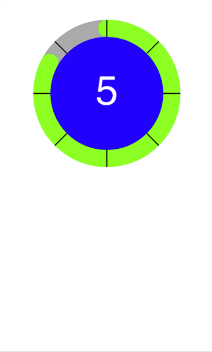

# CircularProgress
A Swift Circular Progress View with numerics, ticks marks and custom color configuration.

# Example #1



Overiding the behavoir of the CirclarCountProgressView

```
class CircularView: CirclarCountProgressView{
    
    override var strokeWidth: CGFloat { get {return 30.0} }
    override var marginWidth: CGFloat { get {return 10.0}}
    override var animationDuration: TimeInterval { get {return 8.0}}

    override var trackColor: CGColor { get {return UIColor.lightGray.cgColor} }
    override var progressColor: CGColor { get {return UIColor.green.cgColor} }
    override var fillColor: CGColor { get {return UIColor.gray.cgColor} }
    override var activeFillColor: CGColor { get {return UIColor.blue.cgColor}}
    override var textColor: CGColor { get {return UIColor.white.cgColor} }

    override var tickCount: Int {get {return 8} }
    override var tickColor: UIColor { get {return UIColor.black}}
    override var tickWidth: CGFloat { get {return 2.0 }}

}
```

strokeWidth: - Is the Width of the green track above
animationDuration: - How long the animation will take to completed

trackColor: - Is the gray track under the green
progressColor: - The green progress bar draw on top of the gray track
fillColor: - The blue color inside of the progress view
activateFillColor: - The color which is display while the numbers are counting
textColor: - The color of the text printed in the center

tickCount: - The number of ticks to draw, this number should be an even number
tickColor: - The color that ticks are drawn with
tickWidth: - The width of the tick

When creating the CircularCountProgressView, the width and the height of the frame must be equal.

